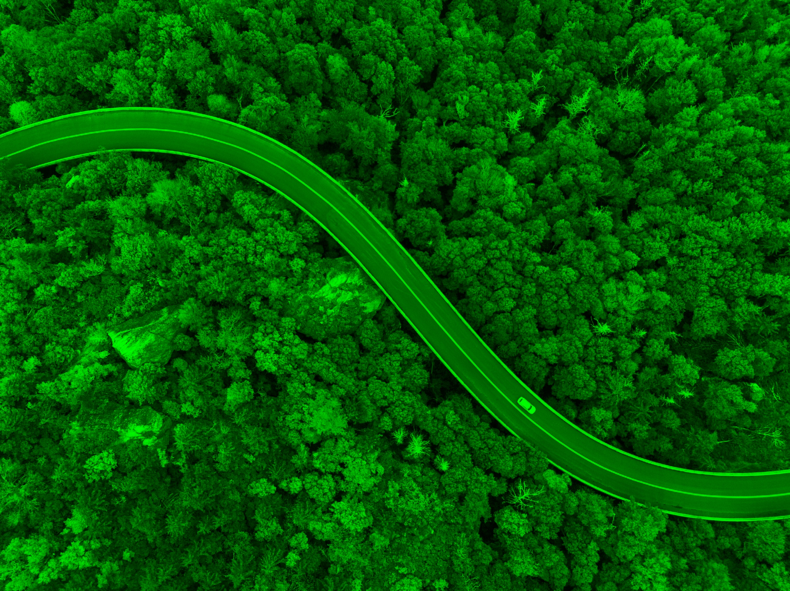

# 🚁 AerialMountainRoadSegmentation  

Algoritmo de visión por computadora que diferencia carreteras de zonas montañosas en imágenes aéreas. Incluye el proceso paso a paso con ejemplos visuales.  

---

## 🎯 Objetivo  
Extraer automáticamente el camino de una imagen aérea de carreteras en entornos montañosos.  

## 🔍 Proceso  

### 📌 Primera prueba: Detección de bordes  
- Implementé una modificación del algoritmo **Sobel** ([archivo](sobelObtimizado.py)) optimizado con:  
  - **Vectorización** para acelerar cálculos.  
  - **Integral de imagen** para reducir operaciones redundantes.  
- **Problema detectado**:  
  - Excesivo ruido por las copas de los árboles (bordes irrelevantes).  
  - Costo computacional alto para filtrar falsos positivos.  

### 📊 Análisis: Canal RGB  
- Experimenté con la separación de canales de color en la carpeta ([Carpeta foto de colores](fotosColores))

| 🖼️ Original | 🔴 Rojo (R) | 🟢 Verde (G) | 🔵 Azul (B) |
|------------|------------|-------------|------------|
|  |  |  |  |
|  |  |  |  |
|  |  |  |  |
|  |  |  |  |
|  |  |  |  |

- **Hallazgo clave**: El canal **azul** destaca mejor las carreteras (las copas de los árboles casi no contienen azul). Se aprecia en las fotografías cómo el verde y el rojo tienen una misma intensidad, pero en el azul se observa cómo destaca la carretera frente a la vegetación notablemente. 

### ⚙️ Solución implementada  
1. **Umbralizado del canal azul**:  
   - Filtro para conservar solo píxeles con valores altos en azul.  
2. **Postprocesamiento**:  
   - Algoritmo recursivo para eliminar **puntos pequeños aislados** (ruido residual). 

---

## 📌 Resultados  
### 🖼️ Ejemplo visual  
| Original | Resultado Final |  
|----------|-----------------|  
|  |  |
|  |  |  
|  |  |
|  |  |
|  |  | 
|  |  | 
|  |  | 
|  |  | 
|  |  |

## 🔍 Pipeline del Algoritmo

1. **Extracción del Canal Azul**
   - Aisla el componente azul (B) de la imagen BGR
   - `b = img[:, :, 0]` (OpenCV usa orden BGR)

2. **Umbralizado Adaptativo**
   - Calcula el umbral como: `media_azul * (1 + factor_boost)`
   - Elimina píxeles con valor azul inferior al umbral

3. **Filtrado de Regiones Pequeñas**
   - Elimina manchas menores a `(alto*ancho)//divisor`
   - Usa BFS (Breadth-First Search) para detectar regiones conectadas

## ⚙️ Parámetros
- **div_umbral**: Tamaño mínimo de regiones (↑ valor = ↓ tamaño mínimo)
- **restriccion_threshol**: Sensibilidad al azul (↑ valor = ↑ exigencia)

## 🛠️ Uso
```python
from filtroColorVerde import filtro_color_azul_elim

img = cv2.imread('imagen.jpg')
resultado = filtro_color_azul_elim(img, div_umbral=16, restriccion_threshold=0.7)
cv2.imwrite('resultado.jpg', resultado)
```

## 🔍 ¿Quieres saber más?
- El archivo principal se encuentra en: **[filtroColorVerde.py](filtroColorVerde.py)**
- Para profundizar en el algoritmo, revisa los comentarios en el código fuente
